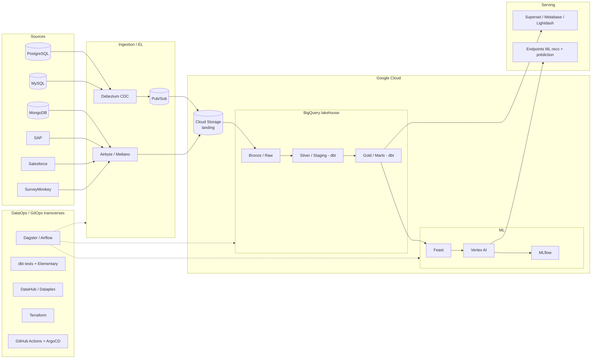

# Astrafy — Data Engineer Take-Home Challenge

Ce dépôt contient les livrables du take-home challenge Data Engineer.

- **Partie 1 — Design Challenge** : architecture d'une data platform moderne sur Google Cloud (voir plus bas + PDF à joindre à l'email).
- **Partie 2 — Coding Challenge** : Infrastructure as Code (Terraform), transformations dbt-core sur le dataset public `bigquery-public-data.crypto_bitcoin_cash`, et CI GitHub Actions.

> L'énoncé demande "un repo Terraform" et "un repo dbt". Pour un take-home, ils sont regroupés ici en **monorepo** (`terraform/`, `dbt/`, `.github/`) afin de simplifier la revue. La séparation en deux repos est triviale (déplacer chaque dossier).

---

## Arborescence

```
.
├── terraform/                 # IaC : projet GCP, datasets BigQuery, service account, WIF
│   ├── bootstrap/             # crée le bucket GCS qui stocke l'état Terraform
│   └── *.tf
├── dbt/                       # projet dbt-core (BigQuery)
│   └── models/
│       ├── staging/           # stg_transactions : 3 derniers mois du raw
│       └── marts/             # address_balances : balance courante hors Coinbase
└── .github/workflows/         # CI : dbt build sur chaque PR (auth via WIF)
```

Chaque dossier (`terraform/`, `dbt/`) contient son propre `README.md` détaillé.

---

## Partie 2 — Démarrage rapide

### 1. Provisionner l'infra (Terraform)

```bash
# a) créer le bucket d'état (une seule fois, dans un projet "seed" existant)
cd terraform/bootstrap
terraform init && terraform apply

# b) provisionner projet + BigQuery + service account + WIF
cd ..
cp terraform.tfvars.example terraform.tfvars   # renseigner les valeurs
terraform init -backend-config="bucket=<votre-bucket-etat>"
terraform plan
terraform apply
```

### 2. Lancer les transformations dbt en local

```bash
cd dbt
export DBT_PROJECT_ID="<project_id créé par Terraform>"
gcloud auth application-default login   # auth locale
dbt deps
dbt build   # exécute les modèles + les tests
```

### 3. CI automatique

À chaque ouverture / mise à jour de Pull Request, le workflow `.github/workflows/dbt_pr.yml` :
1. s'authentifie à GCP via **Workload Identity Federation** (sans clé),
2. installe dbt et ses dépendances,
3. lance `dbt build`.

Les secrets/variables GitHub à configurer sont listés dans [`dbt/README.md`](dbt/README.md).

---

## Partie 1 — Architecture (résumé)

Plateforme **lakehouse GitOps** sur GCP, open-source au maximum :



| Couche | Choix (open-source) | Alternative GCP native |
|---|---|---|
| Ingestion batch | Airbyte / Meltano | Datastream |
| CDC temps réel | Debezium + Pub/Sub | Datastream |
| Landing | Cloud Storage | — |
| Warehouse | BigQuery (Bronze/Silver/Gold) | + BigLake/Iceberg pour éviter le lock-in |
| Transformation | **dbt-core** | Dataform |
| Orchestration | Dagster / Airflow (Cloud Composer) | — |
| Qualité data | dbt tests + Elementary / Great Expectations | Dataplex DQ |
| ML | Feast + MLflow + Vertex AI | Vertex AI |
| BI | Superset / Metabase / Lightdash | Looker |
| Catalog / lineage | DataHub / OpenMetadata | Dataplex |
| IaC / GitOps | Terraform + GitHub Actions + ArgoCD/Flux | — |

**Trade-offs assumés** : BigQuery est retenu malgré l'exigence "open-source" car c'est le moteur analytique de référence sur GCP ; on limite le lock-in via BigLake/Iceberg et une couche de transfo portable (dbt). SAP est le connecteur le plus délicat (extraction dédiée SLT/Datasphere si les connecteurs Airbyte sont insuffisants). Le PDF détaille ces choix.
